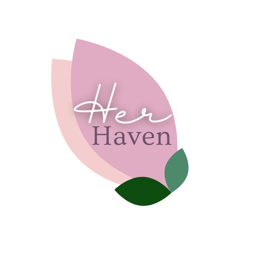

<div align="center">



# HerHaven 🌸

### *Empowering Women Through Technology & Health Awareness*

A comprehensive women's health tracking platform that brings cycle tracking, pregnancy support, mood journaling, and health insights into one beautiful, private space.

---

[](https://opensource.org/licenses/MIT)
[](CONTRIBUTING.md)
[]()
[](https://reactjs.org/)
[](https://www.typescriptlang.org/)
[](https://www.php.net/)
[](https://tailwindcss.com/)
[]()
[]()

[Features](#-features) • [Tech Stack](#-tech-stack) • [Getting Started](#-getting-started) • [Contributing](#-contributing) • [Roadmap](#-roadmap)

</div>

---

## 📖 Table of Contents

- [About HerHaven](#-about-herhaven)
- [Features](#-features)
- [Tech Stack](#-tech-stack)
- [Getting Started](#-getting-started)
  - [Prerequisites](#prerequisites)
  - [Frontend Setup](#frontend-setup)
  - [Backend Setup](#backend-setup)
- [Project Structure](#-project-structure)
- [Contributing](#-contributing)
- [Roadmap](#-roadmap)
- [Screenshots](#-screenshots)
- [Community](#-community)
- [License](#-license)
- [Maintainers](#-maintainers)
- [Acknowledgments](#-acknowledgments)

---

## 🌟 About HerHaven

**HerHaven** is more than just a health tracker—it's a sanctuary for women to understand, manage, and celebrate their bodies. Built with privacy, empowerment, and modern technology at its core, HerHaven provides:

- 🩸 **Intelligent Cycle Tracking** with AI-powered predictions
- 🤰 **Pregnancy Journey Support** with week-by-week guidance
- 💭 **Mood & Symptom Journaling** to understand patterns
- 📊 **Health Metrics Dashboard** with beautiful visualizations
- 🌓 **Dark Mode** for comfortable usage anytime
- 🔒 **Privacy-First Design** - your data stays yours

> *"Technology should empower, not exploit. HerHaven is built by women, for women, with respect and care at every line of code."*

---

## ✨ Features

### 🔄 Cycle Tracking
- **Predictive Analytics**: C++-powered algorithms for accurate period predictions
- **Symptom Logging**: Track physical and emotional symptoms
- **Fertility Window Insights**: Understand your most fertile days
- **Cycle History**: Beautiful calendar views of past and future cycles

### 🤰 Pregnancy Support
- **Week-by-Week Guide**: Personalized information for each stage
- **Milestone Tracking**: Document your pregnancy journey
- **Health Reminders**: Never miss an appointment or prenatal vitamin
- **Growth Tracker**: Monitor baby's development

### 📝 Mood & Journal
- **Daily Mood Tracking**: Understand emotional patterns across your cycle
- **Private Journaling**: Secure, searchable entries
- **Pattern Recognition**: AI insights on mood-cycle correlations
- **Export Data**: Take your journal anywhere

### 📊 Health Dashboard
- **Visual Analytics**: Beautiful charts powered by Recharts
- **Health Metrics**: Track weight, BMI, blood pressure, and more
- **Custom Reports**: Generate insights for doctor visits
- **Secure Data**: End-to-end encrypted storage

### 🎨 User Experience
- **Modern UI**: Built with shadcn/ui and Tailwind CSS
- **Dark Mode**: Easy on the eyes, day or night
- **Responsive Design**: Perfect on desktop, tablet, and mobile
- **Accessibility**: WCAG 2.1 AA compliant

---

## 🛠️ Tech Stack

### Frontend
<div align="center">

| Technology | Purpose | Version |
|-----------|---------|---------|
|  | UI Framework | 18.3.1 |
|  | Type Safety | 5.8.3 |
|  | Build Tool | 5.4.19 |
|  | Styling | 3.4.17 |
|  | Components | Latest |
|  | Routing | 6.30.1 |
|  | Data Fetching | 5.83.0 |
|  | Data Visualization | 3.2.1 |

</div>

### Backend
<div align="center">

| Technology | Purpose | Version |
|-----------|---------|---------|
|  | Server Language | 8.4.13 |
|  | Database | Latest |
|  | ML Modules | Latest |
|  | Dependency Manager | Latest |
|  | Testing | 10.5 |

</div>

### Development Tools
- **ESLint** - Code linting
- **Git** - Version control
- **GitHub Actions** - CI/CD (planned)
- **Docker** - Containerization (planned)

---

## 🚀 Getting Started

### Prerequisites

Before you begin, ensure you have the following installed:

```bash
# Check Node.js version (v18+ required)
node --version

# Check npm version
npm --version

# Check PHP version (8.4+ required)
php --version

# Check Composer
composer --version

# MySQL/MariaDB (10.0+ required)
mysql --version
```

### Frontend Setup

1. **Clone the Repository**
   ```bash
   git clone https://github.com/yourusername/HerHaven.git
   cd HerHaven
   ```

2. **Navigate to Frontend Directory**
   ```bash
   cd frontend
   ```

3. **Install Dependencies**
   ```bash
   npm install
   # or
   yarn install
   # or
   bun install
   ```

4. **Start Development Server**
   ```bash
   npm run dev
   ```
   The app will be available at `http://localhost:5173`

5. **Build for Production**
   ```bash
   npm run build
   ```

### Backend Setup

1. **Navigate to Backend Directory**
   ```bash
   cd backend
   ```

2. **Install PHP Dependencies**
   ```bash
   composer install
   ```

3. **Configure Database**
   ```bash
   # Copy example config
   cp utils/config.example.php utils/config.php
   
   # Edit config.php with your database credentials
   ```

4. **Create Database**
   ```bash
   # Log into MySQL
   mysql -u root -p
   
   # Create database
   CREATE DATABASE herhaven;
   
   # Import schema
   mysql -u root -p herhaven < database/schema.sql
   
   # Run migrations
   mysql -u root -p herhaven < database/migrations/001_create_tables.sql
   ```

5. **Compile C++ Modules** (Optional - for ML features)
   ```bash
   cd cpp-modules
   g++ -o cycle_prediction cycle_prediction.cpp
   g++ -o health_metrics health_metrics.cpp
   ```

6. **Run Tests**
   ```bash
   ./vendor/bin/phpunit
   ```

7. **Start PHP Development Server**
   ```bash
   php -S localhost:8000
   ```
   API will be available at `http://localhost:8000`

### Environment Variables

Create a `.env` file in the frontend directory:

```env
VITE_API_URL=http://localhost:8000/api
VITE_APP_NAME=HerHaven
VITE_ENABLE_ANALYTICS=false
```

---

## 📁 Project Structure

```
HerHaven/
├── frontend/                    # React TypeScript frontend
│   ├── src/
│   │   ├── components/         # Reusable UI components
│   │   ├── pages/              # Page components
│   │   ├── hooks/              # Custom React hooks
│   │   ├── lib/                # Utilities and helpers
│   │   └── main.tsx            # Entry point
│   ├── public/                 # Static assets
│   ├── css/                    # Global styles and themes
│   ├── html/                   # Static HTML pages (legacy)
│   └── package.json
│
├── backend/                     # PHP backend API
│   ├── api/                    # API endpoints
│   │   ├── auth.php           # Authentication
│   │   ├── cycle.php          # Cycle tracking
│   │   ├── mood.php           # Mood tracking
│   │   ├── journal.php        # Journal entries
│   │   └── pregnancy.php      # Pregnancy tracking
│   ├── database/               # Database files
│   │   ├── schema.sql         # Database schema
│   │   ├── migrations/        # Database migrations
│   │   └── queries.sql        # Common queries
│   ├── utils/                  # Utility functions
│   │   ├── config.php         # Configuration
│   │   ├── helpers.php        # Helper functions
│   │   └── validation.php     # Input validation
│   ├── cpp-modules/            # C++ ML modules
│   │   ├── cycle_prediction.cpp
│   │   └── health_metrics.cpp
│   ├── tests/                  # PHPUnit tests
│   └── composer.json
│
├── docs/                        # Documentation (if needed)
├── Contributing.md              # Contribution guidelines
├── LICENSE                      # MIT License
└── README.md                    # This file
```

---

## 🤝 Contributing

We love contributions from the community! HerHaven is an open-source project built with care, and we welcome:

- 🐛 Bug reports and fixes
- ✨ New feature suggestions
- 📝 Documentation improvements
- 🎨 UI/UX enhancements
- 🧪 Test coverage improvements
- 🌍 Translations and localization

### How to Contribute

1. **Fork the Repository**
   ```bash
   git clone https://github.com/yourusername/HerHaven.git
   cd HerHaven
   ```

2. **Create a New Branch**
   ```bash
   git checkout -b feature/your-amazing-feature
   ```

3. **Make Your Changes**
   - Write clean, documented code
   - Follow existing code style
   - Add tests if applicable
   - Update documentation

4. **Test Your Changes**
   ```bash
   # Frontend
   cd frontend && npm run lint
   
   # Backend
   cd backend && ./vendor/bin/phpunit
   ```

5. **Commit Your Changes**
   ```bash
   git add .
   git commit -m "feat: add amazing feature"
   ```
   
   Use [Conventional Commits](https://www.conventionalcommits.org/):
   - `feat:` New features
   - `fix:` Bug fixes
   - `docs:` Documentation changes
   - `style:` Code style changes (formatting)
   - `refactor:` Code refactoring
   - `test:` Test additions/changes
   - `chore:` Build process or auxiliary tool changes

6. **Push to Your Fork**
   ```bash
   git push origin feature/your-amazing-feature
   ```

7. **Open a Pull Request**
   - Go to the original repository
   - Click "New Pull Request"
   - Describe your changes
   - Link any related issues

### Code of Conduct

HerHaven is a safe, inclusive space. We expect all contributors to:
- Be respectful and kind
- Welcome newcomers
- Accept constructive criticism
- Focus on what's best for the community

For detailed guidelines, see [CONTRIBUTING.md](Contributing.md)

### Good First Issues

New to open source? Look for issues tagged with:
- `good first issue` - Perfect for beginners
- `help wanted` - We'd love your help
- `documentation` - Help improve our docs

---

## 🗺️ Roadmap

### ✅ Completed (v0.1 - v0.3)
- [x] Core cycle tracking functionality
- [x] Mood tracking and journaling
- [x] Beautiful UI with shadcn/ui components
- [x] Dark mode implementation
- [x] Responsive design
- [x] Basic pregnancy tracking
- [x] User authentication
- [x] MySQL database schema
- [x] PHP REST API
- [x] C++ prediction algorithms

### 🔄 In Progress (v0.4 - Current)
- [ ] Advanced analytics dashboard
- [ ] Export data functionality
- [ ] Calendar widget improvements
- [ ] PWA support (offline mode)
- [ ] Email notifications
- [ ] Multi-language support (i18n)

### 🔮 Upcoming (v0.5+)
- [ ] Mobile app (React Native)
- [ ] Wearable device integration (Fitbit, Apple Watch)
- [ ] Community forum
- [ ] Health provider sharing (secure)
- [ ] AI-powered insights and recommendations
- [ ] Medication tracking
- [ ] Appointment scheduling
- [ ] Chat support
- [ ] API for third-party integrations
- [ ] Docker containerization
- [ ] CI/CD pipeline

### 🌠 Dream Features (v1.0+)
- [ ] Telemedicine integration
- [ ] Nutritional tracking
- [ ] Exercise integration
- [ ] Mental health resources
- [ ] Partner/family access (with permissions)
- [ ] Research participation options
- [ ] Open datasets for women's health research (anonymized)

> **Want to see a feature?** [Open an issue](https://github.com/yourusername/HerHaven/issues/new) and let's discuss it!

---

## 📸 Screenshots

<div align="center">

### Dashboard

*Beautiful, intuitive dashboard with health insights at a glance*

### Cycle Tracking

*Visual cycle calendar with predictions and symptom logging*

### Mood Journal

*Track your moods and discover patterns*

### Dark Mode

*Gorgeous dark theme for comfortable nighttime use*

</div>

> 📝 *Screenshots are placeholders. Add your own by replacing the image URLs above!*

---

## 🌐 Community

Join our growing community of contributors, users, and women's health advocates!

- 💬 **Discussions**: [GitHub Discussions](https://github.com/yourusername/HerHaven/discussions)
- 🐛 **Issues**: [Bug Reports & Feature Requests](https://github.com/yourusername/HerHaven/issues)
- 📧 **Email**: contact@herhaven.org (placeholder)
- 🐦 **Twitter**: [@HerHavenApp](https://twitter.com/HerHavenApp) (placeholder)
- 💼 **LinkedIn**: [HerHaven](https://linkedin.com/company/herhaven) (placeholder)

### Contributors ✨

Thanks goes to these wonderful people:

<!-- ALL-CONTRIBUTORS-LIST:START -->
<!-- Contributor list will be automatically generated here -->
<!-- ALL-CONTRIBUTORS-LIST:END -->

Want to be on this list? [Contribute](#-contributing) to HerHaven!

---

## 📄 License

This project is licensed under the **MIT License** - see the [LICENSE](LICENSE) file for details.

```
MIT License

Copyright (c) 2025 Noor Ul Ain Jellani

Permission is hereby granted, free of charge, to any person obtaining a copy
of this software and associated documentation files (the "Software"), to deal
in the Software without restriction, including without limitation the rights
to use, copy, modify, merge, publish, distribute, sublicense, and/or sell
copies of the Software, and to permit persons to whom the Software is
furnished to do so, subject to the following conditions:

The above copyright notice and this permission notice shall be included in all
copies or substantial portions of the Software.
```

**TL;DR**: You can use, modify, and distribute this project freely. Just give credit! 💜

---

## 👥 Maintainers

<table>
  <tr>
    <td align="center">
      <a href="https://github.com/yourusername">
        
        <br />
        <sub><b>Noor Ul Ain Jellani</b></sub>
      </a>
      <br />
      <sub>Project Creator</sub>
    </td>
    <!-- Add more maintainers here -->
  </tr>
</table>

> **Interested in becoming a maintainer?** Active contributors who demonstrate commitment to the project may be invited to join the core team!

---

## 🙏 Acknowledgments

HerHaven wouldn't be possible without:

- 💜 **The Open Source Community** - For incredible tools and inspiration
- 🎨 **shadcn/ui** - For beautiful, accessible components
- ⚡ **Vite & React** - For blazing-fast development
- 🎯 **Radix UI** - For unstyled, accessible primitives
- 📊 **Recharts** - For stunning data visualizations
- 🌈 **Tailwind CSS** - For utility-first styling
- 🔧 **All Contributors** - Every PR, issue, and suggestion matters
- 👩‍⚕️ **Medical Advisors** - For ensuring accuracy and safety
- 🌸 **Every Woman** - Who deserves better health tools

### Special Thanks

- Women's health advocates and researchers
- Privacy-first technology initiatives
- Open-source maintainers worldwide
- Early testers and feedback providers

---

<div align="center">

## 💜 Built with Love for Women's Health

**HerHaven** - *Your Body, Your Data, Your Sanctuary*

⭐ **If you find HerHaven helpful, please consider starring this repository!** ⭐

[Get Started](#-getting-started) • [Contribute](#-contributing) • [Report Bug](https://github.com/yourusername/HerHaven/issues) • [Request Feature](https://github.com/yourusername/HerHaven/issues)

---

*Made with ❤️ by women, for women, with allies welcome*

[](https://forthebadge.com)
[](https://forthebadge.com)
[](https://forthebadge.com)

</div>

